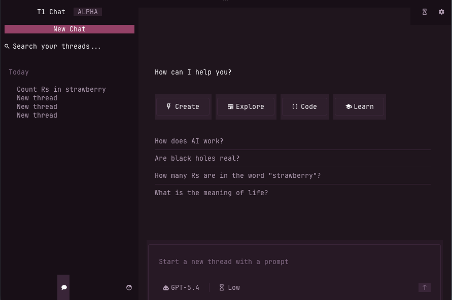

<div align="center">

# t1code

[](./LICENSE)
[](https://www.npmjs.com/package/@maria_rcks/t1code)
[](https://github.com/ahzs645/t1chat)


_T3Code, but in your terminal._

</div>

## t1code (code mode)

Run instantly:

```bash
bunx @maria_rcks/t1code
```

Install globally:

```bash
bun add -g @maria_rcks/t1code
```

Develop from source:

```bash
git clone https://github.com/ahzs645/t1chat.git
cd t1code
bun install
bun dev:tui
```

## t1chat (chat mode)

<div align="center">

</div>

t1chat is a chat-focused mode that transforms the TUI into a conversational interface inspired by [T3 Chat](https://t3.chat). It features a pink/magenta/lavender theme, a flat thread list grouped by time, and a streamlined UI without code-specific tools.

### What changes in chat mode

- Sidebar shows a flat thread list grouped by time (Today, Yesterday, Last 7 Days, etc.) instead of nested projects
- "New Chat" button and thread search in the sidebar
- Title shows "T1 Chat" instead of "T1 Code"
- Git tools, diff viewer, Chat/Plan toggle, and Full access button are hidden
- Settings and temp chat toggle in the top-right corner
- Composer placeholder says "Type your message here..."
- Pink/magenta/lavender color scheme matching T3 Chat

### Run chat mode

If installed globally:

```bash
t1chat
```

Run instantly:

```bash
bunx @maria_rcks/t1code t1chat
```

Develop from source:

```bash
git clone https://github.com/ahzs645/t1chat.git
cd t1code
bun install
T1CODE_CHAT_MODE=1 bun dev:tui
```

<sub>Based on T3 Code by [@t3dotgg](https://github.com/t3dotgg) and [@juliusmarminge](https://github.com/juliusmarminge).</sub>
